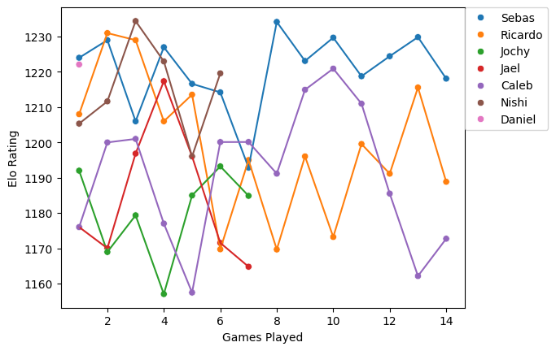

# Multiplayer Elo Rating database and calculator

This was created as a personal proyect for my playgroup for the game 'The Binding of Isaac: Four Souls'; it is a card game designed by Edmund McMillen. Based on the indie video game The Binding of Isaac, players control one of several characters as they defeat bosses to collect Lost Souls.

This code can be applied to any multiplayer games and should work correctly.

This Elo rating calculator takes a datasheet of matches played, and performs calculations based on djcunningham0's [MultiElo](https://github.com/djcunningham0/multielo/tree/main) package.

From this code  we are able to obtain a leaderboard, Continous Match Results, and the players Elo rating over matches played.

The starting Elo rating given to the first set of players is 1200, later this starting ratiing will be updated to be the mean of the ratings in the coollected data.

### Leaderboard:
|Name|Elo                          |Wins  |
|----|-----------------------------|------|
|Sebas|1227                        |2.0   |
|Ricardo|1206                      |1.0   |
|Caleb|1201                        |1.0   |
|Jochy|1192                        |0.0   |
|Jael|1170                         |0.0   |

### Match Results:
|Name|Date                         |Result|Match|Elo |New_Elo|
|----|-----------------------------|------|-----|----|-------|
|Sebas|2024-07-23                  |1     |1    |1200|1224   |
|Ricardo|2024-07-23                |2     |1    |1200|1208   |
|Jochy|2024-07-23                  |3     |1    |1200|1192   |
|Jael|2024-07-23                   |4     |1    |1200|1176   |
|Ricardo|2024-07-23                |1     |2    |1208|1231   |
|Sebas|2024-07-23                  |2     |2    |1224|1229   |
|Jael|2024-07-23                   |3     |2    |1176|1170   |
|Caleb|2024-07-23                  |4     |2    |1200|1176   |
|Caleb|2024-08-26                  |1     |1    |1176|1200   |
|Ricardo|2024-08-26                |2     |1    |1231|1229   |
|Sebas|2024-08-26                  |3     |1    |1229|1206   |
|Sebas|2024-08-26                  |1     |2    |1206|1227   |
|Caleb|2024-08-26                  |2     |2    |1200|1201   |
|Ricardo|2024-08-26                |3     |2    |1229|1206   |

### Elo Rating over Matches Played:
